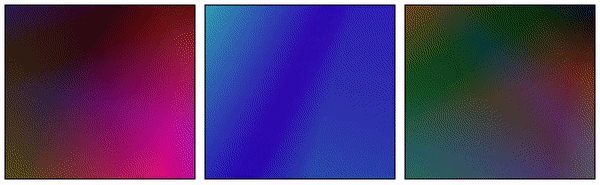

# Why did I Create `NeatGradients`?

We can create some interesting patterns for backgrounds using CSS gradients.

I got the idea for animating and manipulating these gradient patterns through JavaScript when I stumbled upon [Granim.js](https://github.com/sarcadass/granim.js).

There are no other JavaScript libraries that did exactly what I wanted to do. Therefore, I set out to create one myself.

Developing this library also gave me the opportunity to improve my Object Oriented Programming skills.

## Installation

You can directly load Colorful on your webpage using the following HTML:

```
<script src="path/to/neat-gradients.js"></script>
```

Helper CSS to move the gradient patterns in different directions is in the `style.css` file. So, you might want to load that as well. 

## Animated Linear Gradients

You can create animated gradients with the `NeatLinear` class to mimic Granim's functionality.


Here is a basic example:

```javascript
let gradientObject =  new NeatLinear({
    element: boxElems[0],
    colors: ['#8063f7', '#d9f764', '#f78164', '#64f781'],
    styleOptions: {
        angle: 90
    },
    classes: 'nbg-move-lr'
});

gradientObject.animateGradient();
```

The `NeatLinear` class allows you to create animated linear gradients at any angle and with as many as six colors.

You can configure `styleOptions` to create smooth transition of colors between two different linear gradients. Take a look at the fifth block in the above image for an example.

### Animated Abstract Gradients

Sometimes, you might want to use more complex backgrounds without necessarily creating common recognizable patterns. The `NeatAbstract` class can help you here.



Here is a basic example:

```javascript
let gradientObject =  new NeatAbstract({
    element: boxElems[0],
    colors: ['#fc0356', '#03fca9', '#56fc03', '#0356fc'],
    classes: 'nbg-move-tb'
});

gradientObject.animateGradient();
```

### Animated ZigZag Patterns

The ZigZag pattern is pretty common and looks great if you choose the right colors. You can create such patterns with ease using the `NeatZigZag` class.


All these patterns were created using the same `NeatZigZag` class by tweaking the values for the `styleOptions` object.

Here is a basic example:

```javascript
let gradientObject =  new NeatZigZag({
    element: boxElems[0],
    colors: ['#b00659', '#8e0547'],
    styleOptions: {
        bandWidth: 5,
        variant: 'uneven'
    },
    classes: 'nbg-move-bt'
});

gradientObject.animateGradient();
```

### Animated Polka Dot Patterns

Polka Dot patterns are also very popular as backgrounds. You can create, manipulate, and animate them easily using the `NeatPolkaDots` class.


Here is the code to create the pattern in the third block:

```javascript
let gradientObject =  new NeatPolkaDots({
    element: boxElems[0],
    colors: ['#b35e51', '#b351a6'],
    styleOptions: {
        bgPosMultipliers: [0, 0, 0, -0.5],
        radii: [30, 60], 
        rings: true,
        baseSize: 80
    },
    classes: 'nbg-move-bt'
});

gradientObject.animateGradient();
```

### Animated UpDownTriangle Patterns

You can use the `NeatUpDownTriangles` class to create animated gradient patterns where half the triangles are facing up and the other half are facing down.


Here is the code to create the animation in the third block:

```javascript
let gradientObject =  new NeatUpDownTriangles({
    element: boxElems[0],
    colors: ['#b5359c', '#912a7d'],
    styleOptions: {
        baseSize: 60,
        variant: 'opposite-stripes'
    },
    classes: 'nbg-move-rl'
});

gradientObject.animateGradient();
```

### Animated Brick Patterns

You can also create gradient patterns that look like a brick wall using the `NeatBricks` class.


The following code will create the animation in the first block for you.

```javascript
let gradientObject =  new NeatBricks({
    element: boxElems[0],
    colors: ['#d05e0b', '#a74b09'],
    classes: 'nbg-move-tb'
});

gradientObject.animateGradient();
```

## Manipulating Gradients

You can update the colors that make up the gradient pattern by updating the value for the `colors` property like this.

```javascript
gradientObject.colors = ['#b8f475', '#97ee33'];
```

Helper classes like `nbg-move-tb`, `nbg-move-lr`, `nbg-move-rl`, and `nbg-move-bt` use CSS keyframe animation to move the gradient in a certain direction.

You can control how fast the pattern moves by setting the animation duration like this:

```javascript
gradientObject.animationDuration = 60;
```

You can also tweak all the values in the `styleOptions` object and see the changes immediately.

Some components of a gradient pattern use CSS variables to animate. You can control the speed of such animations by setting a value for the `tickSpeed` property.

## To Do List

1. Create a detailed documentation.
2. Add more gradient patterns.
3. Make the `NeatLinear` gradients more flexible.

If you have any other suggestions, I would be glad to hear them.


